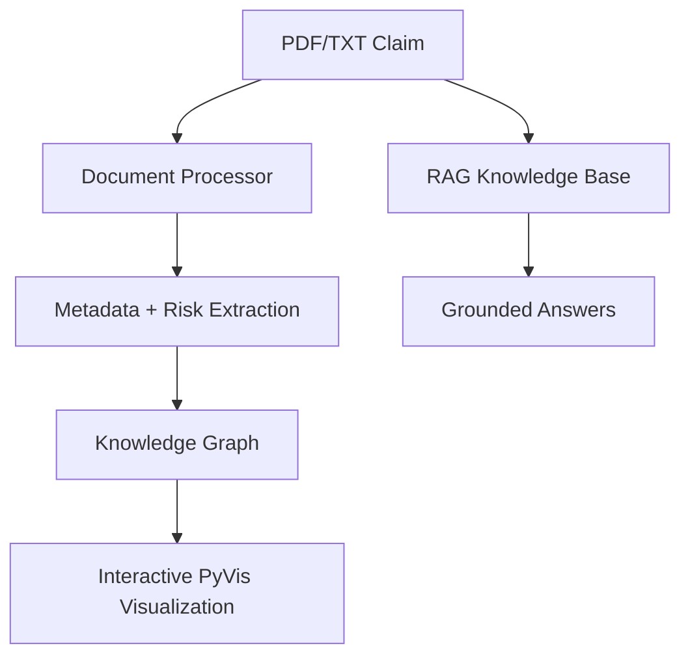

# Insurance Claim AI Assistant

**AI-powered insurance claims processing platform** — Document intelligence, RAG knowledge assistant, and interactive knowledge graph.

**Live Demo** → [https://brian-giordano-insurance-claim-ai-srcuiapp-udsijp.streamlit.app/](https://brian-giordano-insurance-claim-ai-srcuiapp-udsijp.streamlit.app/)

---

### ✨ Features

- **📄 Document Analysis** — Instantly extracts metadata, risk scores, and AI recommendations from PDFs/TXT
- **💡 Insurance Knowledge Assistant** — Accurate, source-grounded answers via custom RAG pipeline
- **🔗 Interactive Knowledge Graph** — Visualize relationships between policies, claimants, claims, and providers
- **🚀 Instant Demo Mode** — Lightning-fast portfolio preview with mock data and caching

---

### 🛠️ Tech Stack & Skills Demonstrated

- **AI Engineering**: Document intelligence, custom RAG system, entity extraction
- **Data Engineering**: Knowledge graph modeling (NetworkX + PyVis), rule-based retrieval
- **Full-Stack Development**: Production-grade Streamlit app with caching, responsive design, and instant demo mode
- **Performance Optimization**: Zero cold-start experience, heavy `@st.cache` usage

### Architecture

### Screenshots

Full app overview with all three tabs visible

Sample claim processed with metrics, risk scores, and recommendations

RAG-powered insurance knowledge assistant with sample questions

Interactive knowledge graph with statistics and path analysis
