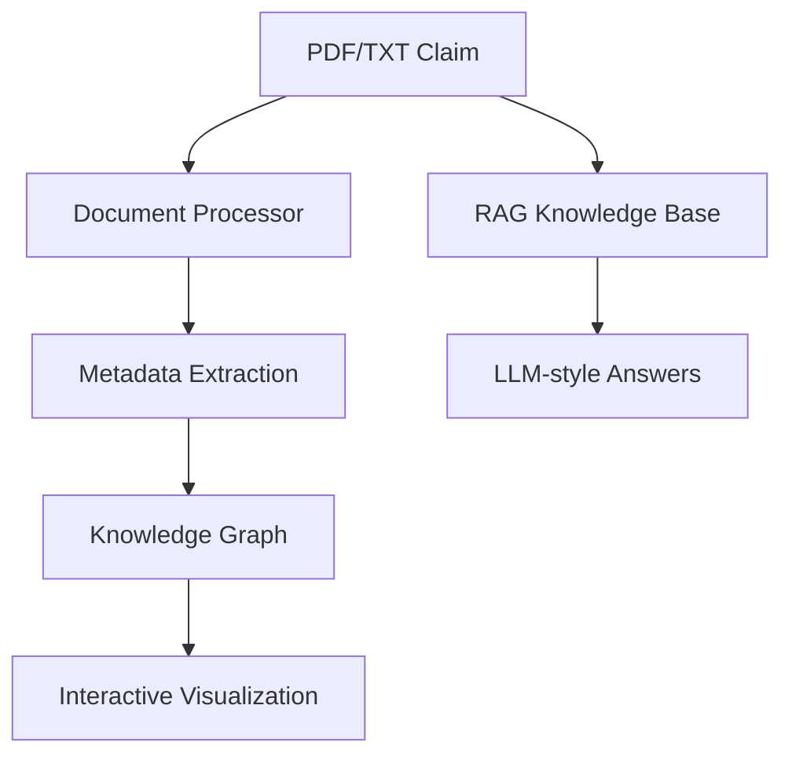

# Insurance Claim AI Assistant

**AI-powered insurance claims processing platform** — Document intelligence, RAG knowledge assistant, and interactive knowledge graph.

  

**Live Demo** → [insurance-claim-ai.streamlit.app](https://YOUR-APP-URL.streamlit.app)

### ✨ Features

- **Instant Document Analysis** — Extracts metadata, risk scores, and recommendations from PDFs
- **Insurance Knowledge Assistant** — Accurate RAG-powered answers with source citations
- **Interactive Knowledge Graph** — Visualize relationships between policies, claimants, claims, and providers

### 🛠️ Tech Stack & Skills Demonstrated

- **AI Engineering**: Custom RAG pipeline, document intelligence, entity extraction
- **Data Engineering**: Knowledge graph modeling (NetworkX + PyVis), rule-based + future vector search
- **Full-Stack**: Production-grade Streamlit app with caching, instant demo mode, and professional UX
- **Performance**: Zero cold-start demo mode, heavy caching, optimized for portfolio viewing

### Architecture

